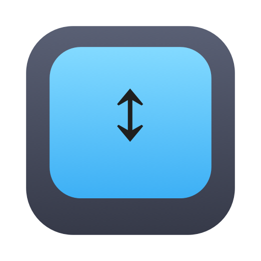
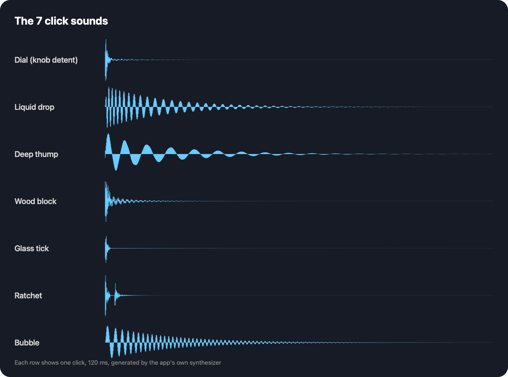

<p align="center"></p>

<h1 align="center">ScrollClick</h1>

A tiny macOS menu-bar app that makes scrolling feel like turning a notched dial: every few points of scroll plays a soft click, and (on Force Touch trackpads) taps a matching haptic.

Inspired by [Snick](https://trysnick.xyz/). This is an independent, open-source take on the idea and is not affiliated with it.

## Features

- **7 click sounds**: Dial, Liquid drop, Deep thump, Wood block, Glass tick, Ratchet, Bubble. All synthesized in code, no audio files.
- **Trackpad haptics** in sync with each click (Force Touch trackpads).
- **Click spacing**: Fine / Normal / Coarse.
- **Speed-aware**: fast flings turn into a soft blur instead of a machine-gun rattle.
- Scrolling up sounds slightly higher than scrolling down.
- Works with trackpads and mouse wheels, with an optional momentum-scroll toggle.
- Volume slider, Open at Login, universal binary (Apple Silicon + Intel), macOS 13+.

## Sounds



## Install

1. Download `ScrollClick.dmg` from [Releases](../../releases).
2. Open it and drag **ScrollClick** into **Applications**.
3. The app isn't notarized, so the first time: right-click it, choose **Open**, then **Open** again.
4. Look for the dial icon in the menu bar and scroll.

If scrolling makes no sound, add ScrollClick under **System Settings → Privacy & Security → Accessibility**.

## Build from source

Needs the Xcode command-line tools (`xcode-select --install`).

```bash
./build.sh
```

This produces `build/ScrollClick.app` and `ScrollClick.dmg`.

## License

MIT
